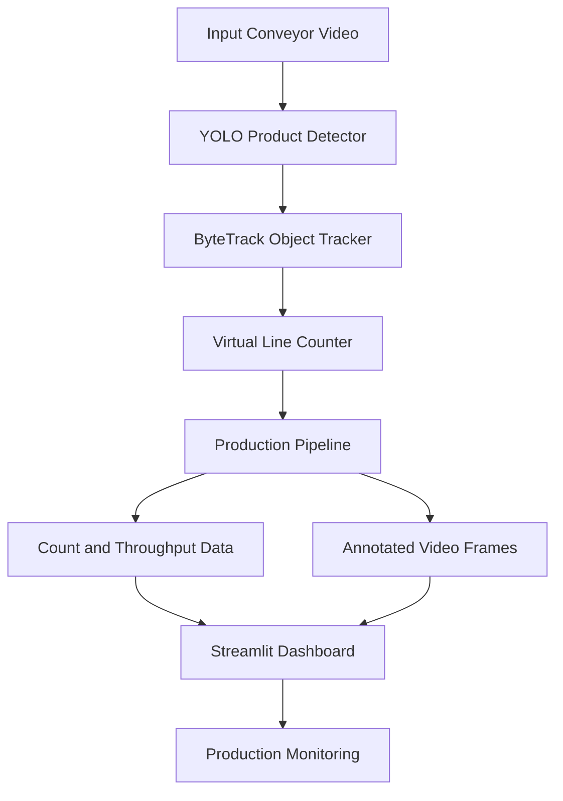

# Smart Factory CV – Production Manager 

An AI-powered production monitoring system that uses computer vision to detect, track, and count products moving on a conveyor belt. It provides real-time production counts and throughput information through a Streamlit dashboard.

## Problem Statement

In manufacturing industries, manually counting products on conveyor belts can be time-consuming and prone to human error. Monitoring multiple product categories and maintaining accurate production records can also be difficult.

This module addresses these challenges by using computer vision to automate product detection, tracking, and counting, helping production managers monitor production more efficiently.

## Solution

The Production Manager module uses a YOLO object detection model to identify products and a tracking system to follow them across video frames. A virtual counting line is used to count each tracked product once when it crosses the line.

The results are displayed on a Streamlit dashboard, where users can monitor product counts, throughput, and video processing progress.

## Features

* **Automated product detection:** Detects brake pads, bearings, spark plugs, and gears.
* **Object tracking:** Uses ByteTrack to maintain object identities across frames.
* **Automated counting:** Counts each tracked product once when it crosses a virtual line.
* **Multi-class counting:** Maintains separate counts for each product category.
* **Throughput monitoring:** Calculates production rates over a rolling time window.
* **Streamlit dashboard:** Displays production counts, throughput, and processing progress.
* **Video-based monitoring:** Processes recorded conveyor belt videos.

## Architecture



## Products Detected

| Class ID | Product    |
| -------- | ---------- |
| 0        | Brake Pad  |
| 1        | Bearing    |
| 2        | Spark Plug |
| 3        | Gear       |

## Technologies Used

* **Python** – Main programming language
* **YOLO (Ultralytics)** – Object detection
* **ByteTrack** – Object tracking
* **OpenCV** – Video processing
* **PyTorch** – Deep learning framework
* **Streamlit** – Interactive dashboard
* **NumPy** – Numerical operations

## Project Structure

```text
smart-factory-cv-production-manager/
│
├── app.py
├── requirements.txt
├── README.md
│
├── cv/
│   └── production/
│       ├── counter.py
│       ├── detector.py
│       ├── tracker.py
│       └── production_pipeline.py
│
├── models/
│   └── best.pt
│
├── data/
│   └── videos/
│       └── test/
│           └── new_video.mp4
│
├── tests/
│   └── count_new_video.py
│
└── .gitignore
```

*The structure above shows the expected key files. Ensure the model and input video are available at the paths configured in the code.*

## Installation and Setup

### 1. Clone the Repository

```bash
git clone https://github.com/hacker99902/ai-powered-production-monitoring.git
```

### 2. Navigate to the Project Folder

```bash
cd smart-factory-cv-production-manager
```

### 3. Create a Virtual Environment

```bash
python -m venv .venv
```

### 4. Activate the Virtual Environment

**Windows PowerShell:**

```powershell
.venv\Scripts\Activate.ps1
```

If PowerShell blocks activation, you can use Command Prompt instead:

```cmd
.venv\Scripts\activate.bat
```

### 5. Install Dependencies

```bash
pip install --upgrade pip
pip install -r requirements.txt
```

### 6. Install PyTorch

If PyTorch is not installed through your environment setup, install a version compatible with your system. For NVIDIA GPU acceleration, follow the official [PyTorch installation instructions](https://pytorch.org/get-started/locally/) and select the appropriate CUDA option.

For CPU inference, install the CPU-compatible PyTorch version.

### 7. Add the Trained Model and Input Video

Make sure the trained YOLO model is available at the model path configured in `app.py`, and the input video is available at the video path configured there.

If these files are not included in the repository, obtain them from the project maintainer or provide your own compatible model and video.

## Requirements

Create a `requirements.txt` file in the project root with:

```txt
streamlit
ultralytics==8.4.167
opencv-python
numpy==1.26.4
pandas
```

Install the packages using:

```bash
pip install -r requirements.txt
```

PyTorch installation may need to be done separately depending on the machine and GPU configuration.

## Run the Application

Once the dependencies, trained model, and input video are ready, run:

```bash
python -m streamlit run app.py
```

Streamlit will provide a local URL, usually:

```text
http://localhost:8501
```

Open this address in your browser to access the dashboard.

## Run the Counting Test

To run the production counting test from the project root:

```bash
python -m tests.count_new_video
```

The test processes the configured video and reports the product counts.

## How It Works

1. **Video input:** The system reads a recorded conveyor belt video frame by frame.
2. **Product detection:** YOLO identifies products such as brake pads, bearings, spark plugs, and gears.
3. **Object tracking:** ByteTrack associates detections across frames and maintains tracking IDs.
4. **Line crossing:** The virtual line counter checks when tracked products cross the configured counting line.
5. **Duplicate prevention:** Each tracked object ID is counted only once.
6. **Throughput calculation:** The pipeline calculates production rates using a rolling time window.
7. **Dashboard:** Streamlit displays the counts, throughput, and processing progress.

## Validated Test Result

In one test using the configured test video, the system produced the following counts:

| Product    |  Count |
| ---------- | -----: |
| Gear       |      4 |
| Spark Plug |      7 |
| Bearing    |      4 |
| Brake Pad  |      3 |
| **Total**  | **18** |

These are results for that specific test video, not a guarantee of accuracy for all production footage.

## My Contribution

My contribution focuses on the Production Manager and Orchestration Engine module.

* Developed the production pipeline to coordinate detection, tracking, and counting.
* Integrated YOLO-based product detection with ByteTrack.
* Implemented virtual line-crossing logic to count tracked objects.
* Added per-class production counts and throughput calculation.
* Integrated production data into a Streamlit dashboard.
* Tested the counting pipeline using recorded conveyor belt footage.

## Limitations

* The current implementation processes recorded videos rather than a live industrial camera feed.
* Counting accuracy depends on model performance, video quality, lighting, occlusion, and tracking reliability.
* Database storage and persistent production reports are not currently implemented.
* GPU acceleration depends on compatible hardware and software configuration.

## Future Improvements

* Live camera integration
* Database-based production history
* Exportable production reports
* Multiple counting lines and conveyor belts
* Alerts for production targets and anomalies
* Improved performance under occlusion and crowded conveyor conditions

## License

Add a license to this repository if you intend to make the project available for reuse. Until then, no reuse permissions are implied.


GitHub: https://github.com/hacker99902/ai-powered-production-monitoring.git
